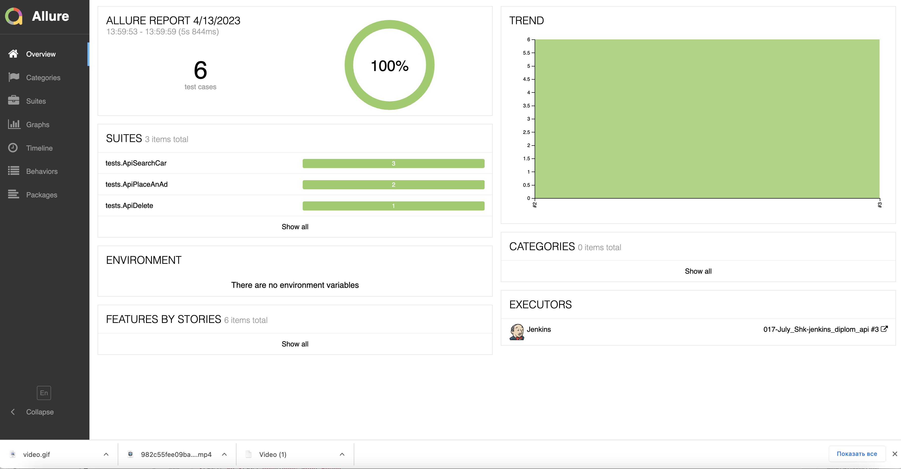
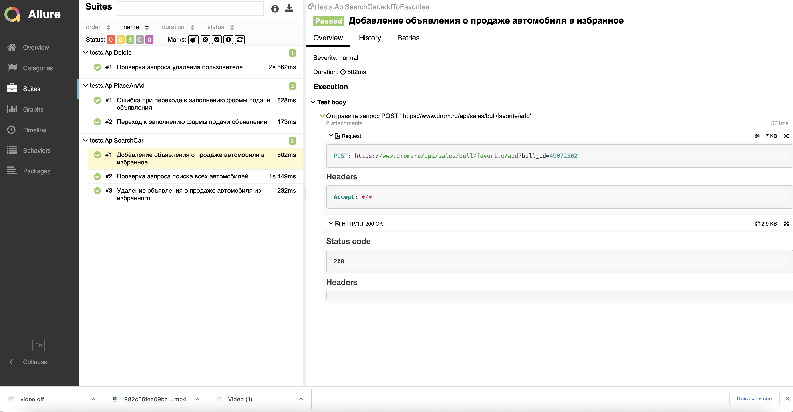
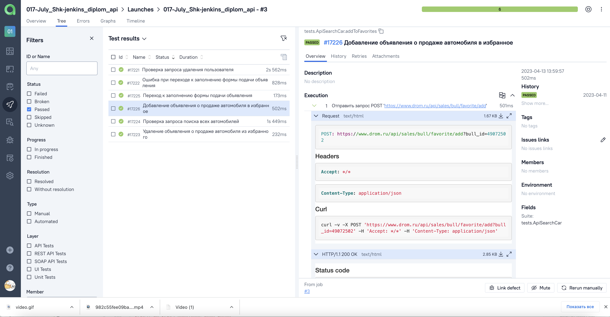
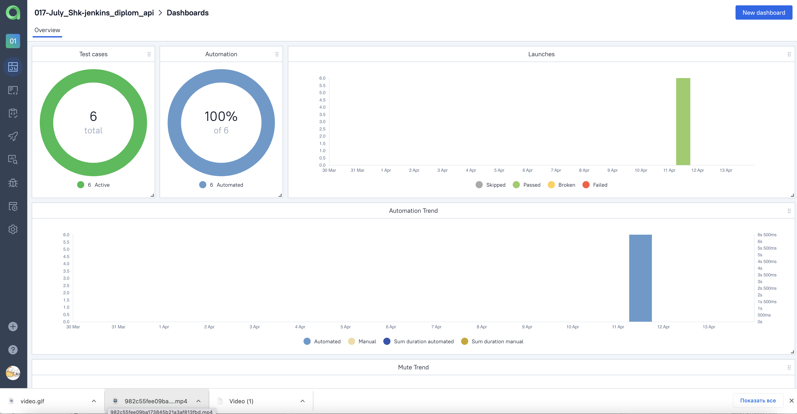

# Проект по автоматизации тестирования сайта Drom.ru
## :receipt: Содержание:

- Реализованные проверки
- Запуск тестов
- Allure-отчет
- Интеграция с Allure TestOps

## :mag_right: Реализованные проверки

Автоматизированные тесты
- ✓ Проверка запроса поиска всех автомобилей (GET)
- ✓ Добавление объявления о продаже автомобиля в избранное (POST)
- ✓ Удаление объявления о продаже автомобиля из избранного (POST)
- ✓ Переход к заполнению формы подачи объявления (GET)
- ✓ Ошибка при переходе к заполнению формы подачи объявления (GET)
- ✓ Проверка запроса удаления пользователя (DELETE)

## :arrow_forward: Запуск тестов

###  Локальный запуск :
Пример командной строки:
```bash
gradle clean test
```
Получение отчёта:
```bash
allure serve build/allure-results
```

###  Удаленный запуск (в Jenkins):
1. Открыть <a target="_blank" href="https://jenkins.autotests.cloud/job/017-July_Shk-jenkins_diplom_api/">проект</a>


2. Выбрать пункт **Собрать сейчас**
3. Результат запуска сборки можно посмотреть в отчёте Allure

## </a> Отчет в <a target="_blank" href="https://jenkins.autotests.cloud/job/017-July_Shk-jenkins_diplom_api/3/allure/">Allure report</a>

###  Главное окно

<p align="center">

</p>

###  Тесты

<p align="center">

</p>


## </a> Интеграция с <a target="_blank" href="https://allure.autotests.cloud/launch/22201">Allure TestOps</a>
### Общий список всех кейсов
<p align="center">

</p>

### Dashboard с общими результатами тестирования
<p align="center">

</p>

